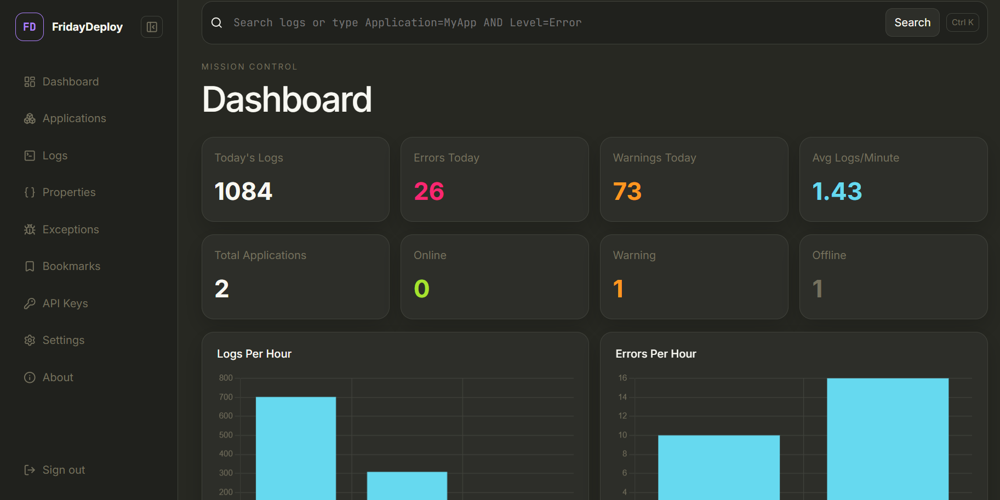
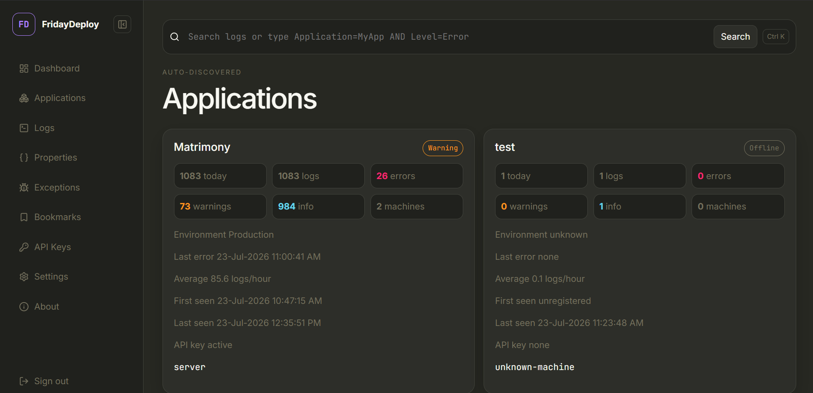
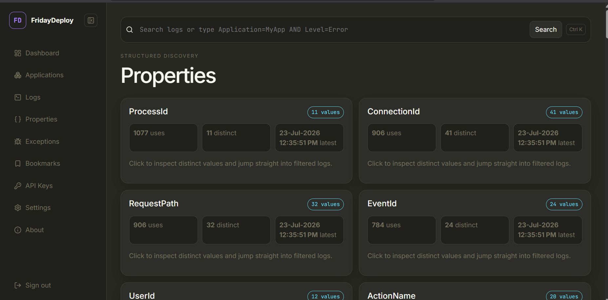
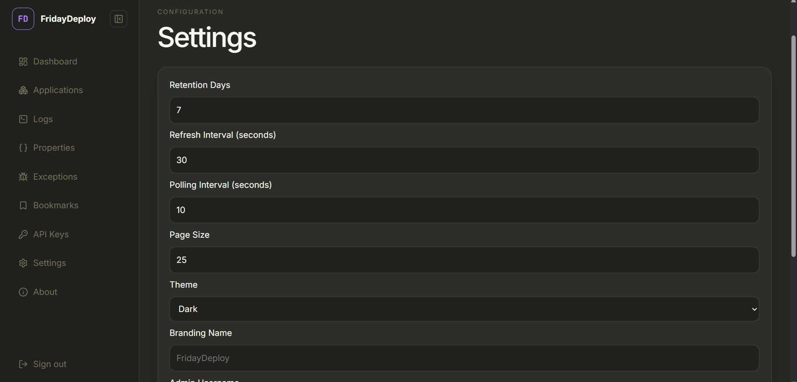

# FridayDeploy

[](https://github.com/hariramstr/FridayDeploy/actions/workflows/build.yml)
[](LICENSE)
[](https://dotnet.microsoft.com/)

**Because production has a sense of humor.**

FridayDeploy is a lightweight, self-hosted, developer-first structured log server for .NET teams. Point a Serilog sink at it, log in, and watch structured events, correlated requests, and exceptions show up in a fast, keyboard-friendly dashboard — no external infrastructure, no per-seat pricing, SQLite by default.

## Overview

- **Self-hosted, single container.** SQLite by default, one Docker Compose file, no message broker or search cluster to run.
- **Structured ingestion.** Ship logs from a real ASP.NET Core app via `FridayDeploy.Serilog`, or `curl` a JSON payload directly.
- **API-key-gated applications.** Each application gets its own key; applications register themselves the first time they send a log.
- **Investigate, not just browse.** Correlation and request timelines, a property explorer, saved searches, bookmarks, and per-log notes.
- **Own your data.** Configurable retention, CSV/JSON/TXT export, and a Swagger-documented API.

## Features

- Structured log ingestion — single event (`POST /api/logs`) or batched (`POST /api/logs/batch`, API-key authenticated)
- `FridayDeploy.Serilog` — async, batched, gzip-compressed, retrying Serilog sink with local disk spooling so no logs are lost during an outage
- API keys per application: create, disable, rotate, delete from the admin UI
- Automatic application registration, with First Seen / Last Seen / machine count and Online / Warning / Offline health
- Dashboard: logs/errors/warnings today, avg logs per minute, top applications, top exceptions, latest deployment activity
- Full-text and structured search with a small query language (`Level=Error AND District~Salem`), correlation and request timelines, exception explorer, property explorer
- CSV / JSON / TXT export of any filtered search
- Saved searches, bookmarks (logs, correlation ids, request ids), and per-log notes
- Dark / Light / System theme, persisted Settings (retention, refresh interval, polling interval, page size, branding), collapsible sidebar
- Swagger / OpenAPI at `/swagger`
- Cookie authentication with BCrypt-hashed passwords, first-run admin bootstrap from configuration
- Configurable nightly retention cleanup, plus a one-click "clear all log data" reset that preserves API keys and settings
- Rate limiting on login and ingestion endpoints, secure/SameSite cookies, CSRF-protected forms, parameterized EF Core queries throughout — see [docs/Security.md](docs/Security.md)
- Unit, EF Core/repository, integration, and API/auth test coverage in `FridayDeploy.Tests`, run on every push via GitHub Actions
- Docker and Docker Compose support, healthcheck included

## Screenshots

| Dashboard | Applications |
|---|---|
|  |  |

| Properties | Settings |
|---|---|
|  |  |

## Installation

```bash
dotnet restore
dotnet run --project FridayDeploy.Web
```

Open the URL Kestrel prints (e.g. `http://localhost:5246`). Log in with the admin credentials from `FridayDeploy.Web/appsettings.json` — **change the default password before exposing this anywhere but localhost.**

### Quick start: send your first log in 5 minutes

1. Run `FridayDeploy.Web` (above) and log in.
2. Go to **API Keys** → create a key, naming the application (e.g. `MyApp`).
3. Reference `FridayDeploy.Serilog` from your app and configure the sink:

   ```csharp
   Log.Logger = new LoggerConfiguration()
       .WriteTo.FridayDeploy(options =>
       {
           options.ServerUrl = "http://localhost:5246";
           options.ApiKey = "the key you just created";
       })
       .CreateLogger();
   ```
4. Log something and check the Dashboard — see [FridayDeploy.SampleApp](FridayDeploy.SampleApp) for a working example with correlation ids and custom properties.

## Docker

```bash
docker compose up --build
```

The app runs on `http://localhost:8080`. SQLite is stored in the `fridaydeploy-data` volume. See [docs/Configuration.md](docs/Configuration.md) for environment variables.

## Configuration

```json
{
  "ConnectionStrings": {
    "DefaultConnection": "Data Source=App_Data/fridaydeploy.db"
  },
  "AdminUser": {
    "Username": "admin",
    "Password": "ChangeThisPassword123!"
  },
  "FridayDeploy": {
    "RetentionDays": 7,
    "RefreshIntervalSeconds": 30,
    "PollingIntervalSeconds": 10,
    "PageSize": 25,
    "Theme": "Dark"
  }
}
```

These are first-run defaults only — after the app starts, Retention/Refresh/Polling/Page Size/Theme/Branding are edited from the **Settings** page and persisted in SQLite, not `appsettings.json`. Full reference: [docs/Configuration.md](docs/Configuration.md).

## Architecture

```text
FridayDeploy.Web        ASP.NET Core MVC + Web API, EF Core/SQLite, the admin UI
FridayDeploy.Serilog    Reusable Serilog sink (NuGet-packable)
FridayDeploy.SampleApp  Minimal app demonstrating the sink end-to-end
FridayDeploy.Tests      Unit, integration, and API tests
```

See [docs/Architecture.md](docs/Architecture.md) for the full breakdown of `FridayDeploy.Web`'s internal layout (Controllers/Services/Data/Models) and design decisions (why SQLite, why cookie + API-key dual auth, why no heavy DI abstractions).

## API

Full reference with schemas and examples: [docs/API.md](docs/API.md), or the live Swagger UI at `/swagger` once the app is running.

Ingest a structured log directly:

```bash
curl -X POST http://localhost:8080/api/logs \
  -H "Content-Type: application/json" \
  -d '{
    "application":"MyApp",
    "level":"Error",
    "message":"Unable to save member",
    "correlationId":"ABC123",
    "requestId":"REQ789",
    "properties": {
      "UserId": 123,
      "District": "Salem",
      "LoanId": 55,
      "Browser": "Chrome",
      "Screen": "Registration"
    }
  }'
```

Ingest a batch under an API key (what the sink does):

```bash
curl -X POST http://localhost:8080/api/logs/batch \
  -H "Content-Type: application/json" \
  -H "X-Api-Key: fd_your_key_here" \
  -d '[{"level":"Information","message":"started"}]'
```

Key endpoints: `POST /api/logs`, `POST /api/logs/batch`, `GET /api/logs`, `GET /api/logs/{id}`, `GET /api/applications`, `GET /api/dashboard`, `GET /api/properties`, `GET /health`.

## Serilog Integration

```csharp
Log.Logger = new LoggerConfiguration()
    .WriteTo.FridayDeploy(options =>
    {
        options.ServerUrl = "https://logs.company.com";
        options.ApiKey = "YOUR_API_KEY";
        options.BatchSizeLimit = 100;
        options.FlushInterval = TimeSpan.FromSeconds(5);
        options.UseGzipCompression = true;
    })
    .CreateLogger();
```

The sink automatically captures Application/Environment/Version/Machine/ThreadId/ProcessId plus `RequestId`, `CorrelationId`, `SourceContext`, `UserId`, and any custom property added with `ForContext`:

```csharp
Log.ForContext("District", "Salem")
   .ForContext("LoanId", 55)
   .ForContext("UserId", 100)
   .Error(ex, "Loan processing failed");
```

Batches are queued asynchronously, compressed, and retried with exponential backoff; if the server is unreachable after all retries, the batch is spooled to disk and resent automatically once it's back — no logs lost. See [FridayDeploy.Serilog/README.md](FridayDeploy.Serilog/README.md).

> **Deploying behind a WAF (Webuzo/cPanel/Plesk)?** If `curl` can reach `/api/logs/batch` fine but the sink consistently gets `Forbidden`, see [docs/Configuration.md](docs/Configuration.md#troubleshooting-sink-gets-403-forbidden-but-curl-works) — it's very likely ModSecurity or a similar bundled WAF flagging the sink's requests, not a FridayDeploy problem.

## Examples

See [FridayDeploy.SampleApp](FridayDeploy.SampleApp) for a runnable ASP.NET Core app that emits Information/Warning/Error/Fatal logs with correlation ids, structured properties, and a background heartbeat.

## Roadmap

Detailed roadmap: [docs/Roadmap.md](docs/Roadmap.md).

- **v1.1** — Alerts (email/webhook notifications), saved dashboards, advanced query language
- **v2** — OpenTelemetry, NLog and `Microsoft.Extensions.Logging` providers, plugin system, PostgreSQL/SQL Server, multi-user/RBAC

## Contributing

See [docs/Contributing.md](docs/Contributing.md) and the [issue templates](.github/ISSUE_TEMPLATE). Every push and pull request runs the full build and `FridayDeploy.Tests` suite via [GitHub Actions](.github/workflows/build.yml); tagged releases (`v*.*.*`) publish the `FridayDeploy.Serilog` NuGet package and a container image automatically ([release.yml](.github/workflows/release.yml)).

## Security

See [docs/Security.md](docs/Security.md) for the threat model, auth design, and how to report a vulnerability.

## License

MIT — see [LICENSE](LICENSE).

## FAQ

**Why SQLite instead of Postgres/SQL Server?** Zero external infra to run — you get a working log server in under two minutes. Postgres/SQL Server support is on the [v2 roadmap](docs/Roadmap.md) for teams that outgrow a single-file database.

**Can I run this without Docker?** Yes — `dotnet run --project FridayDeploy.Web` works directly; Docker is for convenience, not a requirement.

**Does the Serilog sink work outside ASP.NET Core?** Yes, it's a plain Serilog sink — any .NET app (console, worker service, WPF, etc.) can use `.WriteTo.FridayDeploy(...)`.

**What happens to logs if FridayDeploy is down?** The sink retries with exponential backoff, then spools failed batches to local disk and resends them automatically once the server is reachable again.

**Is this multi-tenant / does it support multiple users?** Not yet — v1 is single-admin. Multi-user/RBAC is on the [v2 roadmap](docs/Roadmap.md).

**How do I wipe test data without losing my API keys?** Settings → Danger Zone → "Clear all log data". It deletes logs, notes, bookmarks, and saved searches, but keeps API keys, registered applications, and your settings intact — no need to re-issue keys or reconfigure the sink afterward.

**The sink gets `Forbidden` (403) but `curl` works against the same URL — why?** This isn't FridayDeploy itself — its own API-key check only ever returns 401, never 403 — so something in front of the app is blocking the request. On shared-hosting panels (Webuzo, cPanel, Plesk) this is almost always a bundled WAF (ModSecurity, Imunify360, etc.) fingerprinting .NET's `HttpClient` differently from curl/a browser and flagging it. Enable `Serilog.Debugging.SelfLog.Enable(Console.Error)` to see the actual response body the sink received (added specifically for this) — a bare, unbranded error page confirms it's an infra-layer block. Full walkthrough, including how to find and except just the offending WAF rule instead of disabling protection entirely: [docs/Configuration.md](docs/Configuration.md#troubleshooting-sink-gets-403-forbidden-but-curl-works).
